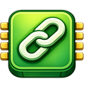

# 🔗 LinkMemory — Universal Content Memory Extension

<p align="center">
  
</p>

**LinkMemory** is a premium, high-performance, and privacy-first Chromium-based browser extension built with MV3. It helps you remember content you have already seen by dynamically tracking visited pages, matching them in real-time using a **Dual-Matching Engine**, and visually marking them with a non-disruptive Red **`SEEN`** badge. 

Whether you are browsing feeds on Medium, Substack, Hashnode, Dev.to, forums, or documentation portals, LinkMemory keeps you focused on unread content without altering page layouts or hiding posts.

---

## 🚀 Quick Download

Get the extension instantly and run it locally:

<p align="center">
  <a href="https://github.com/0xrohitsen/LinkMemory/archive/refs/heads/main.zip" style="text-decoration: none;">
    
  </a>
</p>

---

## 🌟 Key Features

1. **Dual Set-Based Matching Engine (O(1) Performance)**
   * **URL Matching**: Checks if a link's destination URL has been visited. If yes, it marks it instantly.
   * **Title Matching**: Checks if the link text matches a title in the database.
   * **The Hybrid Advantage**: If *either* matches, you get the Red `SEEN` badge! This guarantees 100% matching accuracy even if feed grid titles differ slightly from the original page headings.

2. **Automated History & Real-Time Auto-Save**
   * LinkMemory monitors your standard navigations. When you visit a page, its URL and cleaned title are securely saved in a single, atomic storage transaction in the background.

3. **Robust Brand Suffix Stripper**
   * Automatically strips generic site name branding suffixes (like ` | Medium`, ` - YouTube`, or ` — Substack`) near the trailing end of document titles. This ensures title text in your feeds matches your history exactly!

4. **Website Selection Scope Mode**
   * **Mode A (Work on all websites)**: Execute globally across all browser tabs.
   * **Mode B (Work only on selected websites)**: Restrict the extension to user-whitelisted domains only (supports subdomains natively).

5. **Aesthetic Settings Tab Options Dashboard**
   * A full-page, standalone Options panel to manage whitelists, clipboard bulk pasting (which ignores blank rows and `"Title"` headers), and high-volume CSV importing/exporting.

6. **Desktop & Mobile Compatibility**
   * Modern, lightweight dark-themed CSS viewport layout fully optimized for both desktop and mobile extension drawers, including **Kiwi Browser** and **Mises Browser** (Android).

7. **100% Privacy & Offline-First**
   * Stored purely on your device inside `chrome.storage.local`. No trackers, no servers, no analytics, and no accounts required.

---

## 📂 File Architecture

```
LinkMemory/
├── manifest.json         # Extension MV3 declarations & permissions
├── background.js         # Service worker tracking installation details
├── content.js            # Page auto-tracker, SPA observer, & visual badging
├── popup.html            # Premium dashboard interface UI
├── popup.css             # Harmonious HSL styling & micro-animations
├── popup.js              # View controller managing state events & imports
├── csv-import.js         # Joint parser for Title CSV rows
├── storage.js            # Promise-based local database manager
├── utils.js              # High-fidelity URL normalizer & title cleaner
└── icons/                # High-fidelity cropped brand icons
    ├── icon16.png        # Maximized 16x16 icon (Toolbar)
    ├── icon48.png        # Maximized 48x48 icon (Management)
    └── icon128.png       # Maximized 128x128 icon (Store/Branding)
```

---

## 🚀 How to Install

### 💻 On Desktop (Chrome, Brave, Edge, Arc)
1. **Download and Extract** the ZIP:
   * [Download LinkMemory ZIP](https://github.com/0xrohitsen/LinkMemory/archive/refs/heads/main.zip) and extract it to a folder on your computer.
2. Open your browser and navigate to the Extensions page:
   * Chrome: `chrome://extensions/`
   * Brave: `brave://extensions/`
3. Toggle the **"Developer mode"** switch in the top-right corner to **ON**.
4. In the top-left, click **"Load unpacked"**.
5. Select the extracted `LinkMemory` folder.
6. **Done!** Pin the extension to your toolbar.

### 📱 On Mobile (Kiwi Browser, Mises Browser)
1. **Download** the ZIP:
   * Open Kiwi/Mises on your Android device and download the [LinkMemory ZIP](https://github.com/0xrohitsen/LinkMemory/archive/refs/heads/main.zip).
2. Open Extensions:
   * Tap the three dots menu and select **Extensions**.
3. Toggle **"Developer Mode"** to **ON**.
4. Tap **"+ (from .zip/.crx/.user.js)"**.
5. Select the downloaded ZIP file from your device files.
6. LinkMemory will load instantly and works natively on mobile blogs and feeds!

---

## 📘 How to Use

### 1. Dynamic Feed Marking
Browse any feed page. As soon as you click a link and visit it, LinkMemory records it. When you return to the feed or go back in history, a Red **`SEEN`** badge will appear next to the visited post.

### 2. bfcache (Back-Forward Cache) Support
If you navigate back to a feed page using your browser's back button, LinkMemory automatically detects the bfcache restore and instantly re-scans the DOM to display your badges without requiring a manual page refresh.

### 3. Restricting Whitelist Domains (Mode B)
1. Open the extension **Full Settings** options tab.
2. Select **"Work only on selected websites"** under Website Scope.
3. Input your desired hosts (e.g. `medium.com`, `hashnode.com`) and click **Add Website**. LinkMemory will run strictly on these platforms!

### 4. Bulk Clipboard Imports
Open the collapsible **"Paste Titles"** panel in the popup or go to the full settings dashboard, paste a raw list of titles copied from your history or spreadsheet, and hit **Save Titles**. They will instantly mark as seen!

---

## 💖 Support & Donations

If LinkMemory helps you organize your reading workflow and browse feeds more efficiently, consider supporting the project:

### 🪙 Donate via EVM (Ethereum, BSC, Polygon, Optimism, Arbitrum, Base)
<p align="center">
  <code><b>0xe8B2e37feCE6E8BC0Ea3EF96c6d870F4F03B2Db7</b></b>
</p>

---

## ✍️ Creator

* **Build By**: [Rohit Sen (@ask_rohitsen)](https://x.com/ask_rohitsen) — feel free to reach out on X for questions, feedback, or collaborations!

* **License**: Open-source under the [MIT License](LICENSE).
